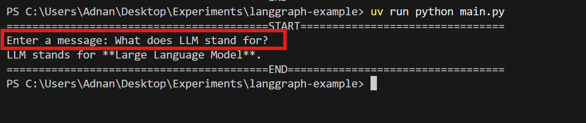
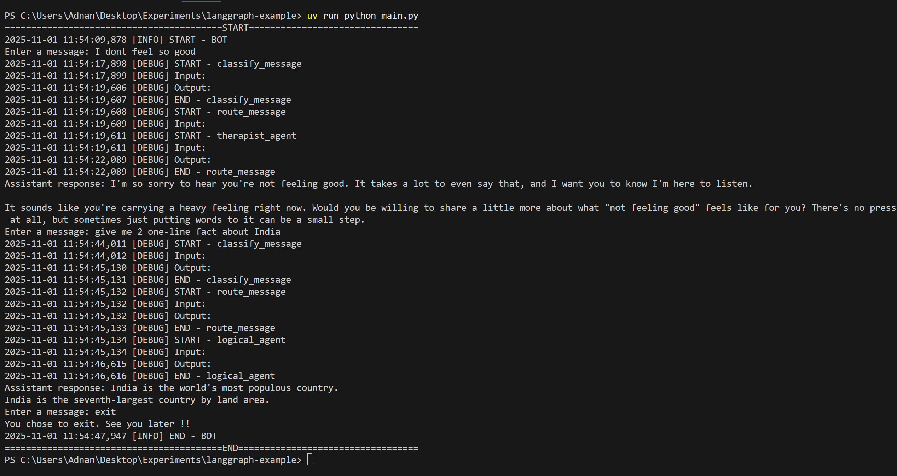

## How to run ?

- Install dependencies `uv add python-dotenv langgraph "langchain[google-genai]" ipykernel`
- Verify the `pyproject.toml` file
- Specify env vars in `.env` file - copy the `.env.template` and create `.env` file
- Run the code `uv run python main.py`

## Usage

Simple Chatbot 
- User inputs in the terminal
- START -> chatbot -> END

Smart Chatbot (2 agents)
- User inputs in the terminal
- START -> Classify_message -> router -> (logical | therapist) -> END

