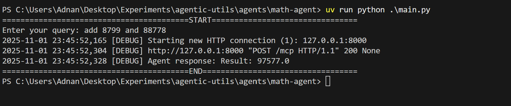
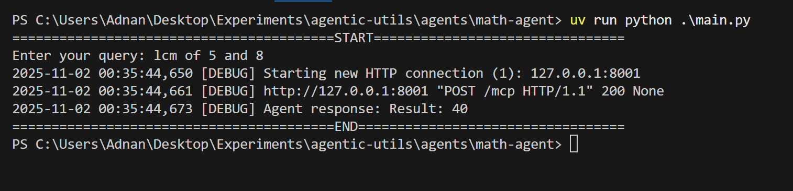

# Math Agent

This project implements a Python-based agent that can classify and execute mathematical tasks using an LLM and MCP servers. It supports operations like GCD, LCM, addition, subtraction, and more by routing user queries to the appropriate computation server.

## Agent Workflow

- User Input: Read the query from the user.
- Classification Node: Use LLM to classify the query into server, tool, and arguments.
- Tool Node: Convert arguments to dictionary and call the JSON-RPC tool.
- Return Result: Display the tool’s result to the user.

## Usage

