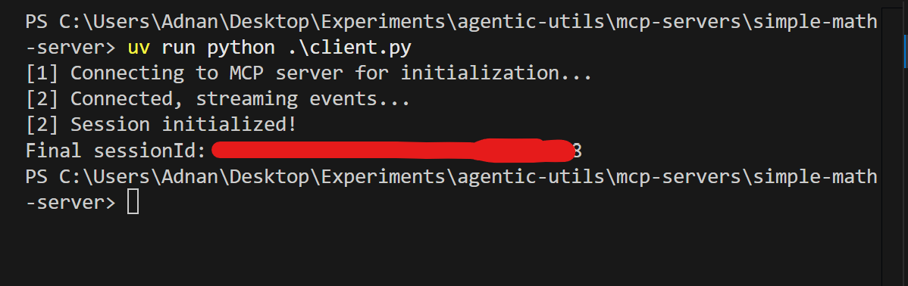

# MCP Servers

1. Run python server
1. Use python client to get sessionId.
2. Use the sessionId to make subsequent calls.

## How to run server ?
- Install dependencies `uv add fastmcp`
- Run `uv run python server.py`

## How to run python client ?
- Run `uv run python client.py`

## How to list and invoke mcp tools ? 

Refer to `list_tools.ps1` and `call_tool.ps1` scripts.

1. Sample output for `list_tools` 

`data: {"jsonrpc":"2.0","id":2,"result":{"tools":[{"name":"add","description":"Add two numbers.","inputSchema":{"properties":{"a":{"type":"integer"},"b":{"type":"integer"}},"required":["a","b"],"type":"object"},"outputSchema":{"properties":{"result":{"type":"integer"}},"required":["result"],"type":"object","x-fastmcp-wrap-result":true},"_meta":{"_fastmcp":{"tags":[]}}}]}}`

2. Sample output for `call_tool` 

`data: {"jsonrpc":"2.0","id":3,"result":{"content":[{"type":"text","text":"8"}],"structuredContent":{"result":8},"isError":false}}`

